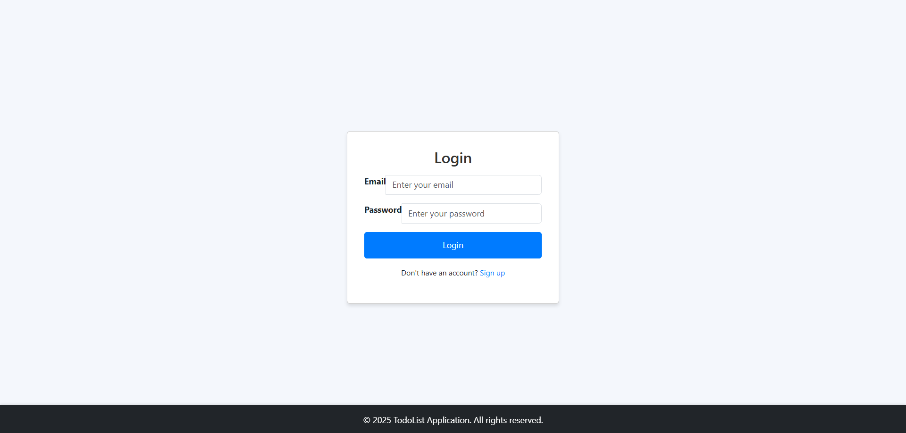
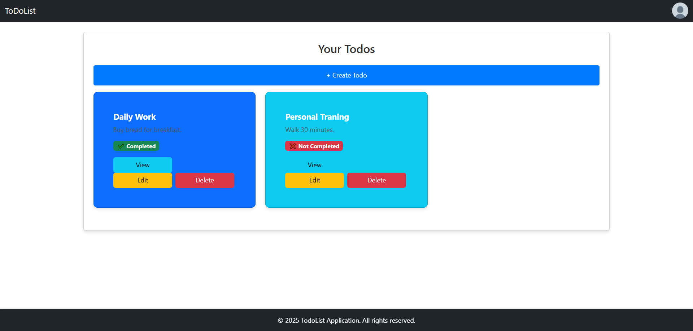
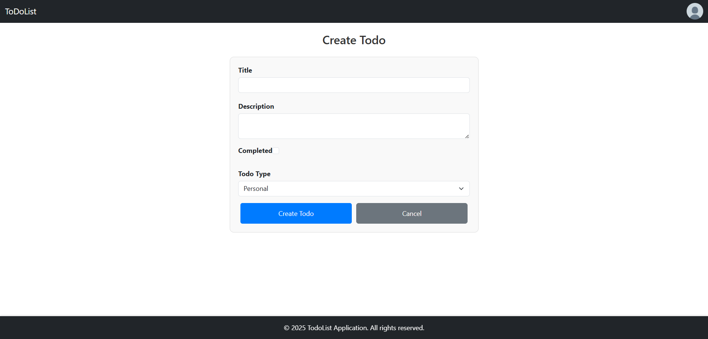
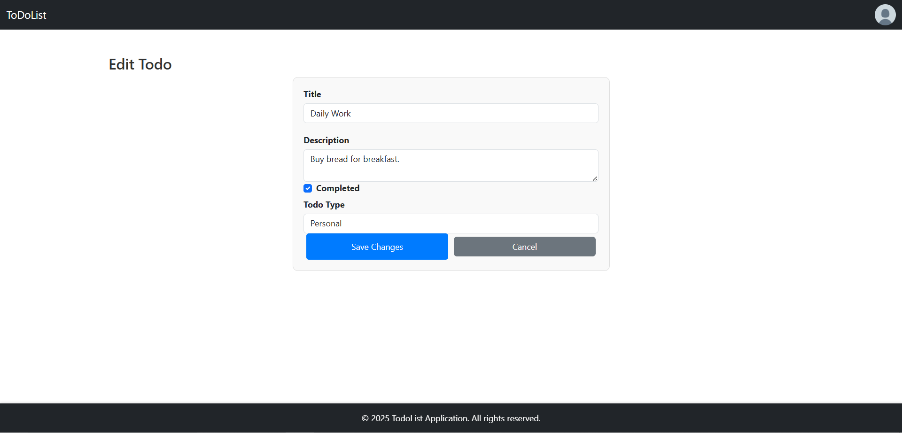

# 📝 Full Stack Todo Application (React + Spring Boot + JWT)

This is a full-stack web application where users can **register**, **log in**, manage their **personal todos**, and **edit their profile**.\
The backend is built with **Spring Boot** and uses **JWT authentication**, while the frontend is built with **React** using **React Router** and **Axios**.

---

## 📁 Project Structure

```
project-root/
│
├── ToDoListApp/              --> Spring Boot Backend
│   ├── src/
│   ├── pom.xml
│   └── ...
│
└── todo-list-app/            --> React Frontend
    ├── src/
    ├── package.json
    └── ...
```

---

## ⚙️ Backend Setup (`ToDoListApp`)

### 🔐 Features

- JWT-based login & signup
- Secure profile editing
- Todo CRUD operations
- CORS support

### 🔧 Requirements

- Java 17+
- Maven
- MySQL Server

### 🛠️ Configuration

In `ToDoListApp/src/main/resources/application.properties`, **edit the following lines to match your MySQL credentials**:

```properties
spring.datasource.url=jdbc:mysql://localhost:3306/todo_db
spring.datasource.username=your_mysql_username
spring.datasource.password=your_mysql_password

spring.jpa.hibernate.ddl-auto=update
spring.jpa.show-sql=true
```

### ▶️ Run the Backend

Navigate to the `ToDoListApp` directory and run:

```bash
./mvnw spring-boot:run
```

Or use your IDE (IntelliJ, Eclipse, etc.) to run the main application class.

> The backend server will start at: `http://localhost:8080`

---

## 🎨 Frontend Setup (`todo-list-app`)

### 🧩 Features

- Login & Signup with JWT
- Token and user ID stored in `localStorage`
- Profile page with update option
- Todo list management (create, update, view, delete)
- Protected routes with route-based redirect
- Bootstrap styling with persistent Navbar & Footer

### 📦 Install Dependencies

Navigate to the `todo-list-app` directory:

```bash
npm install
```

### ▶️ Run the Frontend

```bash
npm run dev
```

> The frontend will run at: `http://localhost:5173`

---

## 🌐 Frontend Routes

| Route                     | Description                         |
| ------------------------- | ----------------------------------- |
| `/login`                  | User login page                     |
| `/signup`                 | User registration page              |
| `/user`                   | Main todo list page (authenticated) |
| `/user/profile`           | Edit profile page                   |
| `/user/todo/create`       | Create a new todo                   |
| `/user/todo/:todoId/edit` | Edit an existing todo               |
| `/user/todo/:todoId`      | View single todo detail             |

---

## 🔒 Authentication Flow

- After login/signup, backend returns JWT token and user ID.
- These values are stored in `localStorage` in the browser.
- Axios requests include the token in the `Authorization` header.
- Protected pages are guarded using React Router and redirect to `/login` if no valid token is found.

---

## 📷 Result

Here are sample screenshots from the working application:

### 🔐 Login Page


### 🏠 Main Page


### 👤 Profile Page


### ➕ Create Todo Page


### ✏️ Edit Todo Page


---

## ✅ Final Notes

- Make sure MySQL is running and the database exists.
- Adjust credentials in `application.properties` as needed.
- Start both frontend and backend servers for full functionality.
- CORS settings must allow requests from `http://localhost:5173` for development.

